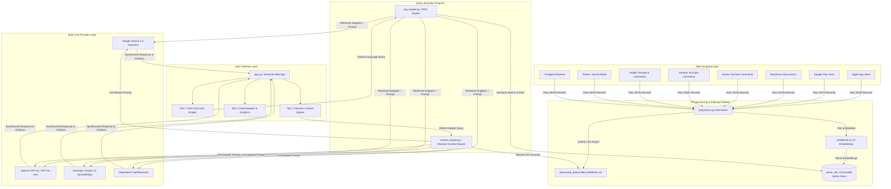
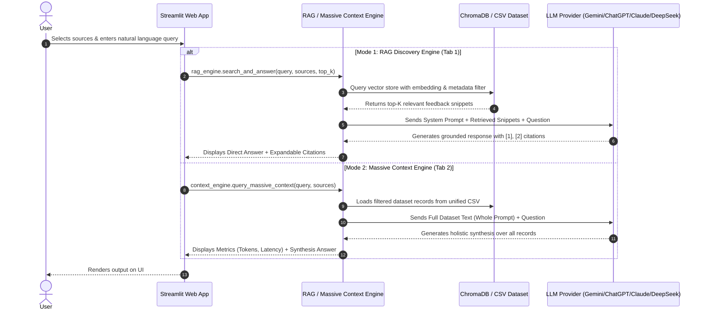

# User Feedback Discovery Engine - Comprehensive Architecture & Technical Documentation

Welcome to the technical documentation for the **User Feedback Discovery Engine**. This document provides an end-to-end breakdown of how customer feedback data is scraped across 8 public domain platforms, normalized, indexed into a vector database, and queried using modern Large Language Model (LLM) architectures.

---

## 1. High-Level System Architecture

The Discovery Engine follows a decoupled, modular architecture designed for local execution and zero-cloud infrastructure dependencies (file-based database and local embedding models).



---

## 2. End-to-End Workflow: From Scraping to Answer Generation

The workflow operates in four main sequential phases:

```
[Phase 1: Scraping] ➔ [Phase 2: Normalization] ➔ [Phase 3: Indexing] ➔ [Phase 4: LLM QA]
```

### Phase 1: Data Scraping across 8 Public Sources

Data is gathered autonomously using dedicated scraping modules tailored to each platform's data structure:

| Source Key | Target Platform | Scraper Mechanism / Script | Output File Path |
| :--- | :--- | :--- | :--- |
| `app_store` | Apple App Store | Node.js + App Store Scraper (`app_store/scrape_app_store_wishlist_6months.js`) | `app_store/nykaa_app_store_reviews.json` |
| `google_store` | Google Play Store | Node.js + Google Play Scraper (`google_store/scrape_wishlist_reviews.js`) | `google_store/nykaa_google_store_reviews.json` |
| `community_discussions` | Mouthshut | Python + BeautifulSoup (`community_discussions/scrape.py`) | `community_discussions/community_discussion_data.json` |
| `youtube_nykaa` | Official Nykaa YouTube | Python + YouTube Data API / Scraper (`youtube_nykaa/scrape_wishlist.py`) | `youtube_nykaa/nykaa_youtube_comments.json` |
| `youtube_data` | General YouTube | Python Scraper (`youtube_data/scrape.py`) | `youtube_data/youtube_comments.json` |
| `reddit_data` | Reddit Threads/Comments | Python + Playwright / PRAW (`reddit_data/scrape_playwright.py`) | `reddit_data/nykaa_playwright_results.json` |
| `social_media` | Twitter / Social Posts | Python Scraper (`social_media/scrape_wishlist_reviews.py`) | `social_media/social_media_discussions.json` |
| `trustpilot` | Trustpilot Reviews | Node.js / Python Scraper (`community_discussions/trustpilot_data/scrape_wishlist_reviews.py`) | `community_discussions/trustpilot_data/nykaa_trustpilot_wishlist_reviews.json` |

---

### Phase 2: Pre-processing & Data Normalization (`preprocess.py`)

Raw JSON formats vary across sources (e.g., App Store uses `title` and `body`, Google Play uses `userName` and `score`, Reddit uses `subreddit` and nested `comments`). 

The `load_raw_data()` function in `preprocess.py`:
1. Reads all raw JSON files.
2. Deduplicates records using unique record IDs or text hashes.
3. Standardizes every item into a uniform dictionary schema:
   ```json
   {
     "id": "uuid-or-unique-key",
     "source_key": "app_store",
     "source_name": "Apple App Store Reviews",
     "platform": "Apple App Store",
     "author": "User123",
     "rating": "5",
     "date": "2026-08-30",
     "url": "https://...",
     "text": "The wishlist feature is great but needs better discount alerts."
   }
   ```
4. Exports the consolidated dataset to `processed_data/unified_feedback.csv`.

---

### Phase 3: Vector Store & Indexing (`ChromaDB`)

To enable fast semantic search:
1. `preprocess.py` initializes a file-based **ChromaDB** client at `./vector_db/`.
2. Uses the lightweight, CPU-efficient `sentence-transformers/all-MiniLM-L6-v2` embedding model.
3. Batch indexes all feedback text entries along with metadata tags (`source_key`, `source_name`, `platform`, `author`, `rating`, `url`).

---

### Phase 4: Query Resolution & Answer Generation

The application provides two complementary query execution engines:



---

## 3. How the LLMs Generate Answers

### 1. RAG Discovery Engine Strategy (Approaches 1 & 3)
* **Semantic Retrieval:** When the user asks a question (e.g., *"What issues do users face with refunds?"*), the query is converted into a 384-dimensional vector embedding. ChromaDB calculates cosine similarity against stored feedback embeddings and retrieves the top-K (e.g., 5 to 20) closest matching snippets.
* **Metadata Filtering:** If the user checks only specific platforms in the sidebar, ChromaDB filters vector results via metadata tags (`where={"source_key": {"$in": selected_sources}}`).
* **Prompt Construction:** The retrieved snippets are formatted into a structured prompt:
  ```text
  System: You are an expert User Feedback Discovery Engine. Answer directly based on the provided feedback snippets. Cite sources as [1], [2].
  
  Snippets:
  [1] Source: Apple App Store | Author: UserA
      Feedback Text: Refund took 10 days to process.
  [2] Source: Play Store | Author: UserB
      Feedback Text: Customer care was unhelpful with my return.
  
  Question: What issues do users face with refunds?
  ```
* **Grounded Answer:** The LLM synthesizes the specific answer grounded strictly in the retrieved evidence, minimizing hallucinations.

---

### 2. Massive Context Engine Strategy (Approach 5)
* **Whole-Dataset Prompting:** For holistic queries requiring overarching analysis across all customer reviews (e.g., *"Rank the top 5 most common feature requests across all platforms"*), semantic top-K retrieval might miss broader trends.
* **Full Context Stream:** This engine loads the entire filtered CSV text into the LLM's massive context window (supported by Gemini 1.5 Pro's 2M token context or Claude 3.5 Sonnet's 200k context window).
* **Context Caching:** For Gemini and Claude, context caching optimizes repeated queries over the same dataset, reducing latency and cost by caching the dataset prompt tokens on the provider server.

---

## 4. Multi-LLM Provider Integration (`llm_provider.py`)

The application features a provider-agnostic LLM interface supporting four major AI providers:

```python
# Standardized multi-provider invocation signature
answer = query_llm(
    provider="Google Gemini",  # Options: Google Gemini, OpenAI ChatGPT, Anthropic Claude, DeepSeek
    api_key="YOUR_API_KEY",
    model_name="gemini-1.5-flash",
    prompt=user_prompt,
    system_prompt=system_prompt
)
```

| Provider | Supported Models | Key Strengths |
| :--- | :--- | :--- |
| **Google Gemini** | `gemini-1.5-flash`, `gemini-1.5-pro` | 2M token context window, Context Caching, fast generation. |
| **OpenAI ChatGPT** | `gpt-4o-mini`, `gpt-4o` | Industry benchmark reasoning and structured output. |
| **Anthropic Claude** | `claude-3-5-sonnet-20240620`, `claude-3-haiku-20240307` | Excellent analytical synthesis and prompt caching. |
| **DeepSeek AI** | `deepseek-chat`, `deepseek-reasoner` | Cost-effective, high-reasoning open API model via OpenAI-compatible SDK. |

---

## 5. Directory & File Structure Map

```
Nykaa scraping/
├── app.py                      # Main Streamlit Web Application (UI layout & tab routing)
├── preprocess.py               # Data normalization pipeline & ChromaDB indexer
├── rag_engine.py               # RAG similarity retrieval & prompt synthesis engine
├── context_engine.py          # Massive Context (Whole Dataset) execution engine
├── llm_provider.py            # Unified API wrapper for Gemini, OpenAI, Claude, DeepSeek
├── requirements.txt           # Python dependencies locked for local & cloud execution
├── run.sh                     # Automated launcher script
│
├── .streamlit/
│   ├── config.toml            # Server settings & theme customization
│   └── secrets.toml.example   # Template for cloud deployment API key secrets
│
├── processed_data/
│   └── unified_feedback.csv   # Normalized CSV dataset combining all 8 sources
│
├── vector_db/                 # Persistent ChromaDB vector database files
│   ├── chroma.sqlite3
│   └── <uuid>/
│
├── docs/
│   └── docs/
│       ├── readme.md           # Architectural & technical documentation (This file)
│       ├── implementation_plan.md
│       └── deployment_plan.md  # Streamlit Community Cloud deployment guide
│
└── [Scraper Directories]
    ├── app_store/             # Apple App Store scraper scripts & raw JSONs
    ├── google_store/          # Google Play Store scraper scripts & raw JSONs
    ├── community_discussions/ # Mouthshut & Trustpilot scraper scripts & raw JSONs
    ├── youtube_nykaa/         # Nykaa Official YouTube channel comment scrapers
    ├── youtube_data/          # General YouTube comment scrapers
    ├── reddit_data/           # Reddit Playwright/PRAW scraper scripts
    ├── social_media/          # Twitter & Social Media scrapers
    └── nykaa_products/        # E-commerce product catalog scrapers
```

---

## 6. How to Run & Use the Discovery Engine

### Running Locally

1. Launch the application via the launcher script:
   ```bash
   cd "/home/testing/Development/Nextleap projects/Nykaa scraping"
   ./run.sh
   ```
2. Open your web browser at **`http://localhost:8501`**.
3. Select your preferred **LLM Provider** in the sidebar and paste your API key.
4. Use **Tab 1** for specific question-answering with citations, **Tab 2** for whole-dataset synthesis, or **Tab 3** to explore raw data records.
